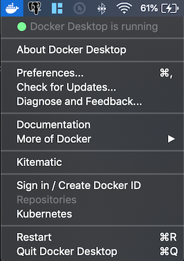

# Getting Started

Running VS Code **inside** a Docker container can be useful for many reasons, but in this walkthrough we'll focus on using a Docker container to set up a development environment that is isolated from your local environment.

## Prerequisites

You need [Visual Studio Code](https://code.visualstudio.com/) installed.

## Install Docker

Docker is needed to create and manage your containers.

### Docker Desktop

Download and install [Docker Desktop](https://www.docker.com/products/docker-desktop).

### Start Docker

Run the Docker Desktop application to start Docker. You will know it's running if you look in the activity tray and see the Docker whale icon.

Docker might take a few minutes to start. If the whale icon is animated, it is probably still in the process of starting. You can click on the icon to see the status.



### Check Docker

Once Docker is running, you can confirm that everything is working by opening a **new** terminal window and typing the command:

```bash
docker --version
# Docker version 18.09.2, build 6247962
```

## Install the extension

The Remote - Containers extension lets you run Visual Studio Code inside a Docker container.

> <a class="tutorial-install-extension-btn" href="vscode:extension/ms-vscode-remote.remote-containers">Install the Remote - Containers extension</a>


### Check installation

With the Remote - Containers extension installed, you will see a new Status bar item at the far left.


The Remote Status bar item can quickly show you in which context VS Code is running (local or remote) and clicking on the item will bring up the Remote - Containers commands.


### Wait for the container to build

The window will then reload, but since the container does not exist yet, VS Code will create one and clone the sample repository into an isolated container volume. This may take some time, and a progress notification will provide status updates. Fortunately, this step isn't necessary the next time you open the folder since the container will already exist.


### Check the container

Once the container is running and you're connected. Open Terminal 

```
.devcontainer/verify.sh 
```


### Run hello/main.tf

In terminal, run

```
terraform -chdir=hello apply
```

### Run hello/main_test.go

In terminal, run

```
make test
```

### References

1. [Terratest](https://terratest.gruntwork.io/)
1. [Terraform](https://learn.hashicorp.com/terraform)